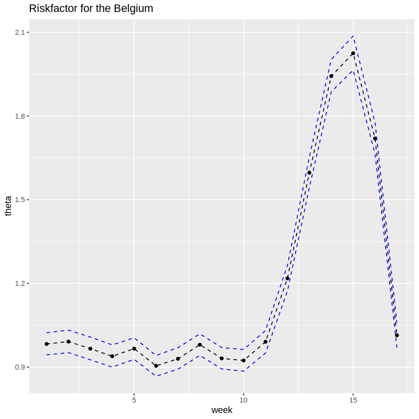
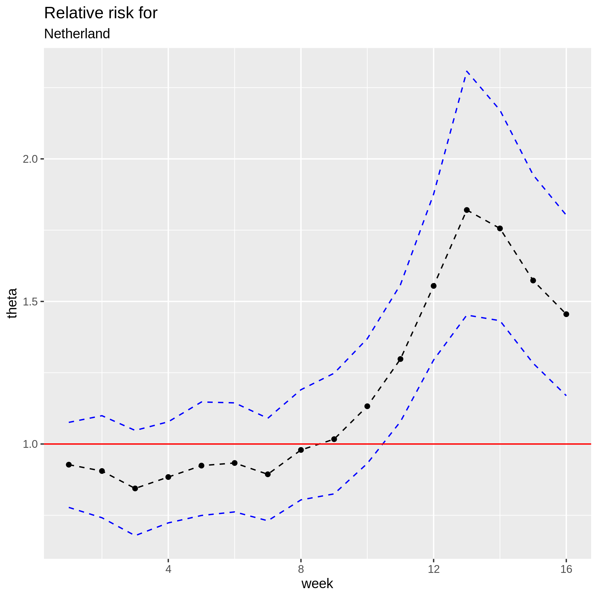
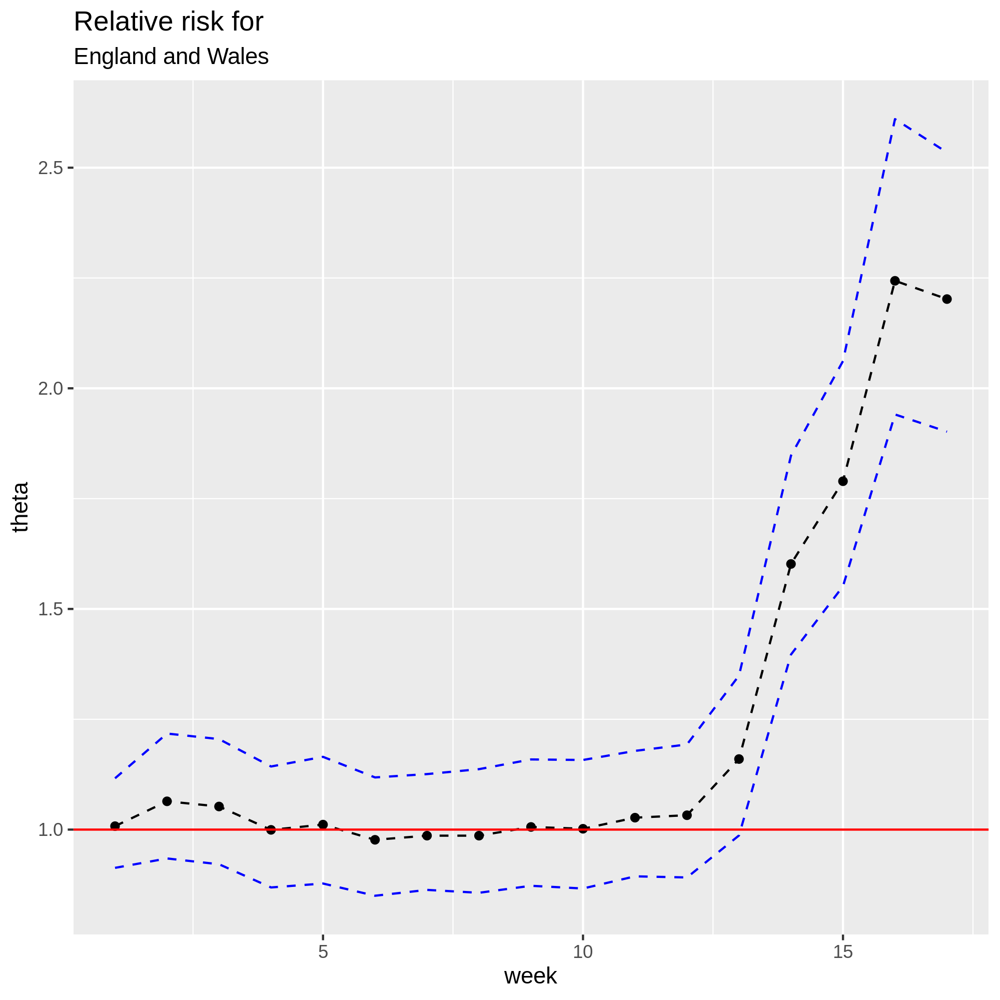
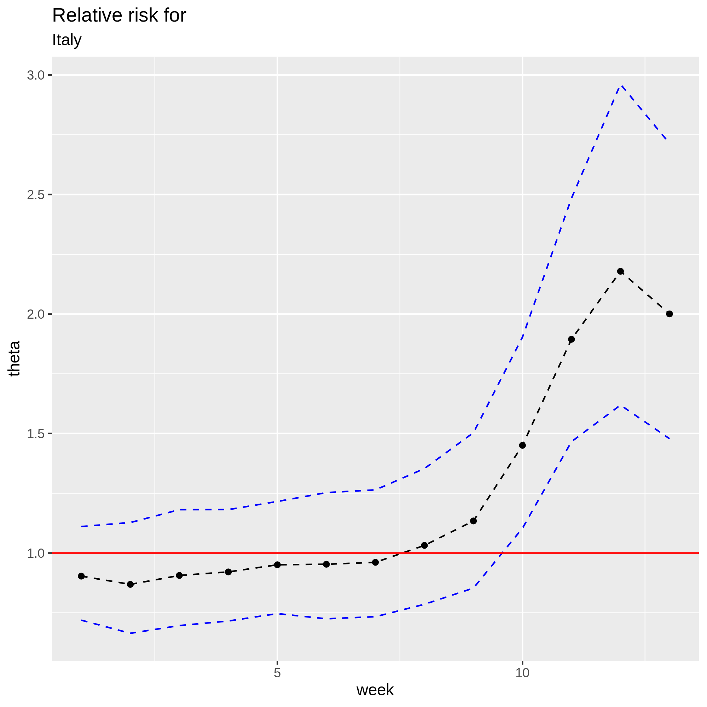
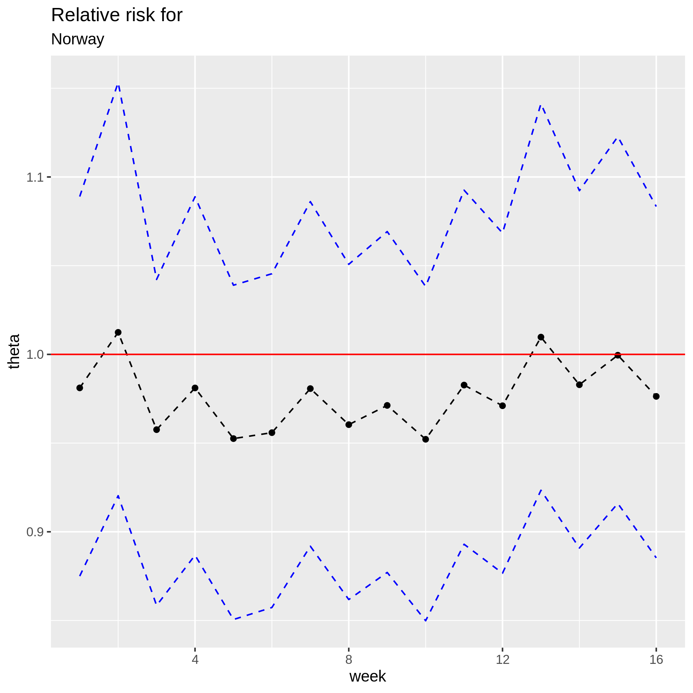
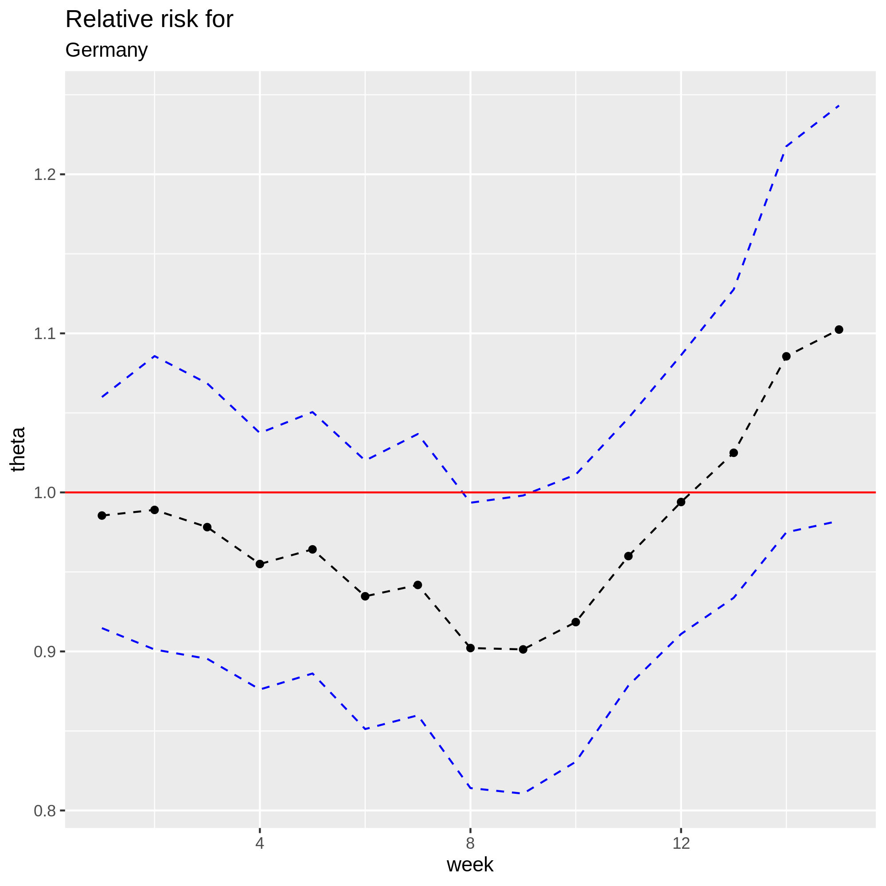
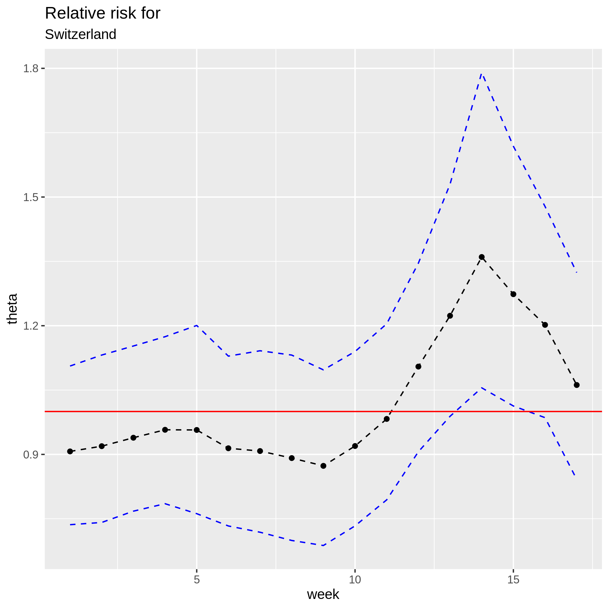
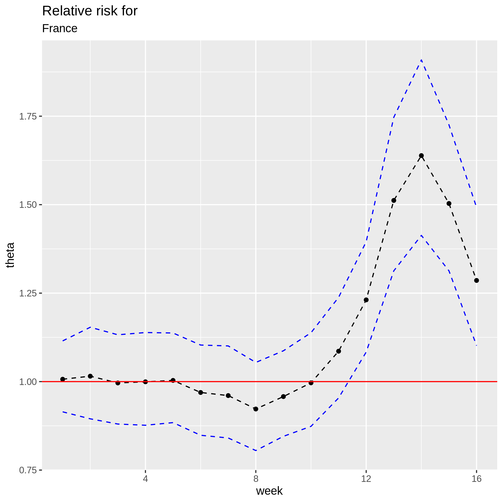

```{r, include=FALSE}
knitr::opts_chunk$set(
  echo = TRUE, warning = FALSE, error = FALSE, message = FALSE,
  tidy.opts = list(width.cutoff = 55), eval = FALSE
)
```


```{r, include=FALSE, eval = TRUE}
library(rstan)
library(ggplot2)
library(tidyr)
library(kableExtra)
library(tidyverse)
library(gridExtra)
library(bayesplot)
```


# Introducion
<!-- Is it okay to change this heading from problem to introducion? :)  -->

As of May 15th 2020, the global death toll of the unfolding COVID-19 outbreak stands at 302 493 (*citation needed*). The global and national official death toll figures have drawn much attention and sparked vivid debate because they are at the center of the evaluation and comparison of the public health responses of national and local governments. 

Among the controversies, there is first a debate of the severity of COVID-19 and many has compared it to the yearly flu outbreaks. Brazil's President Jair Bolsonaro refered the COVID-19 as a 'little flu' and refused to implement in his country the drastic lockdown measures that many other countries have enforced (*citation needed*). 

Second, the limits of testing in terms of tests availability and accuracy have led many observers to point out the likelihood of underreporting of deaths due to the novel virus. Moreover, deaths that might be indirectly due to the COVID-19 crisis because of, for example, a collapse of the health system, are not counted in official figures. On April 26th 2020, the Financial Times headlined that global coronavirus death toll could be 60% higher than reported (*citation needed*). 

Finally, differences in testing and reporting policies across countries but also within regions have casted more doubts on the veracity of the reported figures. Belgium has reported the highest number of deaths per 100 000 inhabitants but Belgian officials also say they are counting in a way that no other country in the world is currently doing: counting deaths in hospitals and care homes, but also including deaths in care homes that are suspected, not confirmed, as COVID-19 cases (*citation needed*).

There is a need of a rigorous estimation of the excess mortality in the weeks of the outbreak. A direct week by week comparison of the observed number of deaths to historical averages as done by the Financial Times analysts is a first approach but is limited as it fails to consider the variance of the number of deaths across years. 

In this report, we propose a Bayesian approach to estimate the excess mortality in the outbreak weeks through relative risk. Our model intends to provide parts of the answer to the following questions:

* Is mortality significantly higher than usual in the weeks of the outbreak?

* If confirmed, is there significant excess mortality on top of the reported COVID deaths?

<!-- * Can country to country differences in known risk factors explain the differences in mortality?  -->

# Data

## Description

Every European state has an established monitoring system of death of nationals, often centralized by the local national statistics institute. Those platforms offer a good quality and reliable source to estimate excess mortality. We gathered weekly data of the total number of deaths for weeks 2 to 17 in the following countries and following years:

* Norway: years 2014 to 2020 

* Netherland: years 2017 to 2020

* Belgium: years 2009 to 2020

* Germany: years 2016 to 2020

* Switzerland: years 2015 to 2020

* Italy: years 2015 to 2020

* France: years 2010 to 2020

* England and Wales: years 2010 to 2020

The data have been retrieved from national statistic institutes of the respective countries. For each country the data were transformed to a similar structure than can be visualized in Table \ref{tab:tab1}. 


<!-- This table is beeing moved by markdown.. not sure if I managed to fix it..  -->
```{r, echo = FALSE, eval = TRUE}
df <- head(read.csv("data/Death_week_2_17_netherland.csv", sep = ";"))
kable(df, "latex",
  align = "c",
  caption = "\\label{tab:tab1} Number of deaths by week in the Netherlands")%>%
  kable_styling(
    latex_options = c("hold_position", "condensed")
  )
```

## Exploratory data analysis

### Visualization

Fig.\ref{fig:fig1} and Fig.\ref{fig:fig2} show the weekly deaths from weeks  
<!-- is it 1:17 or 2-17?? -->
1 to 17 for each of the countries and each of the years. Most countries have graphs showing the same pattern with a large peak between weeks 10 and 16 in 2020 which clearly stands out of from other years. Notably, Switzerland graph show a peak in the same weeks in 2020 but it is not larger than other peaks observed in previous years. Norway shows no peak. On the contrary it shows a decrease, which might be due to a lag in the registration of deaths. 

<!-- This might be a common factor but not so easy to spot in the other countries since the deths are much higher, we should probably go over all data in a week or so to see if 2020 has updated -->

```{r, echo = FALSE, eval = TRUE}
data_netherland<- read.csv("data/Death_week_2_17_netherland.csv", sep = ";")
data_england_wales <- read.csv("data/England_Wales_weekly.csv",sep = ";")
data_italy <- read.csv("data/italy_week_deaths.csv", sep = ",")
data_norway<- read.csv("data/Norway_total_death.csv", sep = ";")
data_france<- read.csv("data/weekly_deaths_france_week1_16_years2010_2020.csv", sep = ",")
data_belgium<- read.csv("data/weekly_deaths_belgium_week1_17_years2009_2020.csv", sep = ",")
data_germany<- read.csv("data/germany.csv", sep = ";")
data_switzerland<- read.csv("data/switzerland.csv", sep = ";")

colnames(data_england_wales)[1] <- "week"
data_england_wales <- data_england_wales[,c(1:11,13)]
colnames(data_germany)[1] <- "week"
data_italy <- data_italy[,2:8]
data_netherland <- data_netherland[,1:5]
colnames(data_switzerland)[1] <- "week"
data_norway <- data_norway[,1:(ncol(data_norway)-1)]
data_norway$week <- 1:17

# data_netherland <- pivot_longer(data_netherland,cols = starts_with("X"),names_to = "year", values_to = "deaths")
# data_england_wales <- pivot_longer(data_england_wales,cols = starts_with("X"),names_to = "year", values_to = "deaths")
# data_italy <- pivot_longer(data_italy,cols = starts_with("X"),names_to = "year", values_to = "deaths")
# data_norway <- pivot_longer(data_norway,cols = starts_with("X"),names_to = "year", values_to = "deaths")
# data_france <- pivot_longer(data_france,cols = starts_with("X"),names_to = "year", values_to = "deaths")
# data_belgium <- pivot_longer(data_belgium,cols = starts_with("X"),names_to = "year", values_to = "deaths")
# data_germany <- pivot_longer(data_germany,cols = starts_with("X"),names_to = "year", values_to = "deaths")
# data_switzerland <- pivot_longer(data_switzerland,cols = starts_with("X"),names_to = "year", values_to = "deaths")

pivot_and_plot <- function(data){
  data <- pivot_longer(data,cols = starts_with("X"),names_to = "year", values_to = "deaths")
  p <- ggplot(data) + geom_line(aes(x=week,y=deaths,col=year)) +
    theme(legend.text=element_text(size=4))
  return(p)
}

datasets <- list(data_netherland,data_england_wales,
                 data_italy,data_norway,data_france,
                 data_belgium,data_germany,data_switzerland)
countries <- c("Netherlands","England & Wales","Italy","Norway",
               "France","Belgium","Germany","Switzerland")
plots <- list()

for(i in 1:length(datasets)){
  plots[[i]] <- pivot_and_plot(datasets[[i]]) + ggtitle(countries[i])
}
```

```{r, echo = FALSE, eval = TRUE, fig.cap="\\label{fig:fig1} Weekly deaths by year and country"}
grid.arrange(plots[[1]],plots[[2]],plots[[3]],plots[[4]],ncol=2)
```
<!-- what is going on with norway? -->


```{r, echo = FALSE, eval = TRUE, fig.cap="\\label{fig:fig1bis} Weekly deaths by year and country bis"}
grid.arrange(plots[[5]],plots[[6]],plots[[7]],plots[[8]],ncol=2)
```

### Overdispersion

<!-- I am not sure this is the corect definition of overdispurtion, I do not think data can be overdispursed. Overdispursion is when w eobserve greater variance than expected wrt a spesific statistical model. -->
<!-- Our data is characterized by much larger variance than mean, it is overdispersed. For example, Table \ref{tab:tab1} shows the weekly means and variance for Belgium. -->

Our data is characterized by much larger variances than means. As an example Table \ref{tab:tab1} shows the weekly means and variances for Belgium.
```{r, echo = FALSE, eval = TRUE}
trans_belgium <- t(data_belgium)[,7:16]
weekly_means <- colMeans(trans_belgium) 
weekly_var <- diag(cov(trans_belgium))

df <- rbind( weekly_means,weekly_var)
row.names(df) <- c("Mean","Variance")

kable(df, "latex",
  booktabs = T,
  align = "c",
  digits = 0,
  col.names = as.character(8:17),
  caption = "\\label{tab:tab2} Means and variances of weekly deaths in Belgium"
  ) %>%
  kable_styling(
    latex_options = c("hold_position", "condensed")
  )
```


# Model 

## Excess mortality

### Statistical model

We approach the modelling of excess mortality by estimating the relative risk $\theta$ understood as the ratio of weekly mortality during the COVID-19 outbreak and the weekly mortality in non-outbreak times.

$$Relative Risk_i = \theta_i = \frac{mortality_{COV,i}}{mortality_{noCOV,i}}=\frac{\frac{O_{COV,i}}{N}}{\frac{O_{noCOV,i}}{N}} = \frac{O_{COV,i}}{O_{noCOV,i}}$$

where $O_{COV,i}$ is the observed number of deaths in week $i$ of COVID outbreak, $O_{noCOV,i}$ the number of deaths for the same week in non-outbreak times and $N$ is the population assumed stable accross years.

The number of deaths $O$ is a count variable. For such variable, two commonly used statistical models are the Poisson model (1) and the negative binomial model (2) which we parametrize with location and scale parameters.

<!-- I think we have to change from P to Poisson because P is easilly confuces with probablility -->

$$(1)\hspace{0.3cm}O_{COV,i} \sim \mathcal{P}(\lambda), \hspace{0.1cm}E(O_{COV,i}) = Var(O_{COV,i}) = \lambda$$

$$(2)\hspace{0.3cm}O_{COV,i} \sim \mathcal{NB}(\mu,\phi),\hspace{0.1cm} E(O_{COV,i}) = \mu, \hspace{0.1cm}V(O_{COV,i}) = \mu+ \frac{\mu^2}{\phi}$$

A major difference between the two is that the Poisson model assumes the mean is equal to the variance while the negative binomial model has an extra parameter that allows to correct for overdispersion observed when using the Poisson model. In other words the Negative Binomial distrubution allows a much higher variance. 

We have:

$$O_{COV,i}= O_{noCOV,i}\cdot\theta_i \Rightarrow E(O_{COV,i})= E(O_{noCOV,i})\theta_i = E_i \theta_i$$

where $E_i$ is the expected number of deaths in week $i$ in non-outbreak times. For each week $i$, we estimate $E_i$  as the historical average of number of deaths in year prior to 2020.

We therefore define the following statistical models:

$$(1)\hspace{0.3cm}O_{COV,i} \sim \mathcal{Pois}( E_i \theta_i)$$

$$(2)\hspace{0.3cm}O_{COV,i} \sim \mathcal{NB}( E_i \theta_i,\phi)$$

In these models, a value of $\theta_i$ larger than 1 can be interpreted as excess mortality in week $i$ with respect to non-outbreak times and a value smaller than 1 as reduced mortality. This approach to modelling mortality is handy as the estimated value is standardized to the expected number of deaths and can therefore be compared between weeks and countries.

From the exploratory data analysis, we see that there is a clear time dependence in the weekly mortality. We therefor introduce a time structured random effect $\theta_t$ in our models. We use an autoregressive structure of order 1 as time structure. Our models then become:

$$(1)\hspace{0.3cm}O_{COV,i} \sim \mathcal{Pois}( E_i\theta_i\theta_{t,i})$$

$$(2)\hspace{0.3cm}O_{COV,i} \sim \mathcal{NB}( E_i \theta_i\theta_{t,i},\phi)$$

where:
$$\log(\theta_{t,i}) = \alpha + \beta \log(\theta_{t,i-1}) $$

### Bayesian model

We propose hierarchichal models for our Bayesian estimation of $\theta$ and $\theta_t$. 

Poisson model (1):

<!-- This is not corretct i think -->

<!-- $$(O_{COV,2},...,O_{COV,17}|(\theta_2,\theta_{t,2}),...,(\theta_{17},\theta_{t,17})) \sim \prod_{i=2}^{17}{\mathcal{P}(E_i \theta_i\theta_{t,i})}$$ -->

$$\forall i,(O_{COV,i}|\theta_i) \sim {\mathcal{Pois}(E_i \theta_i\theta_{t,i})}$$

with parameters priors:

$$(\log(\theta_2),...\log(\theta_{17})) \sim \mathcal{N}(0,\sigma)$$

$$\forall i,\log(\theta_{t,i}) = \alpha + \beta \log(\theta_{t,i-1}) +\epsilon, \hspace{0.15cm} \epsilon \sim \mathcal{N}(0,\sigma_t)$$


where $\sigma$, $\alpha$, $\beta$ and $\sigma_t$ are hyperparameters with hyperpriors:

$$\sigma \sim \mathcal{U}(a_{\sigma},b_{\sigma})$$
$$\alpha \sim \mathcal{N}(\mu_{\alpha},\sigma_{\alpha})$$
$$\beta \sim \mathcal{U}(a_{\beta},b_{\beta})$$
$$\sigma_t \sim \mathcal{N}(\mu_{\sigma_t},\sigma_{\sigma_t})$$

Similarly the negative binomial model (2) is:

<!-- $$(O_{COV,2},...,O_{COV,17}|(\theta_2,\theta_{t,2}),..,(\theta_{17},\theta_{t,17})) \sim \prod_{i=2}^{17}{\mathcal{NB}(E_i (\theta_i\theta_{t,i})}$$  also th phi is missing-->

$$\forall i,(O_{COV,i}|\theta_i, \phi) \sim {\mathcal{NB}(E_i \theta_i\theta_{t,i}, \phi)}$$


with parameters priors:

$$(\log(\theta_2),...,\log(\theta_{17})) \sim \mathcal{N}(0,\sigma)$$

$$\forall i,\log(\theta_{t,i}) = \alpha + \beta \log(\theta_{t,i-1}) +\epsilon, \hspace{0.15cm} \epsilon \sim \mathcal{N}( E_i \theta_i\theta_{t,i},\phi)$$

$$\phi \sim \mathcal{U}(a_{\phi},b_{\phi})$$

where $\sigma$, $\alpha$, $\beta$ and $\sigma_t$ are hyperparameters with hyperpriors:

$$\sigma \sim \mathcal{U}(a_{\sigma},b_{\sigma})$$
$$\alpha \sim \mathcal{N}(\mu_{\alpha},\sigma_{\alpha})$$
$$\beta \sim \mathcal{U}(a_{\beta},b_{\beta})$$
$$\sigma_t \sim \mathcal{N}(\mu_{\sigma_t},\sigma_{\sigma_t})$$
### Choise of hyperpriories

The choises for the hyperpriories and there distributions are slightly based on trial and error. 

For the dispurtion parameter it is important that it containes the value of the historical avarage since a dispurtion of this size would make the variance linear in the average instead of quadratic which corresponds to variances observed in historical data. However we did not want to rule out smaller or larger values. Hence the choice fell on a uniform distribution with bounds $a_{\phi} = 1$ and $b_{\phi} = 6000$.

For $\sigma$ we choose a uniform distribution since we do not have information about the variance of this risk factor. One wants the riskfactor to have the possibility of taking values with quite some variance hence the bounds were chosen to be $[0.01, 4]$

The $\alpha$ parameter is the costant with regards to the timedependency and is expexted to be around zero. This leads us to a normal distribution with $\mu_{\alpha} =0$ and $\sigma_{\alpha} =4$ to allow for other values. 

The $\beta$ parameter is the weight og the timedependency parameter which should fall in the interval $[-1,1]$ hence a uniform distribution with these bounds are choosen. 

Finally the parameter $\sigma_{t}$ was chosen to be a halfnormal distribution with parameters $\mu_{\sigma_{t}} =0$ and $\sigma_{\sigma_{t}} =25$ to allow for a large variance also here. Although one expects the variance to be closer to zero. The halfnormal ensures possitive values.

## Excess mortality on top of the reported COVID deaths

To model excess mortality on top of reported COVID deaths, we will use the same approach as for the modelling of excess mortality during the COVID-19 outbreak with respect to non-outbreak times. We previously estimated the relative risk $\theta$ understood as the ratio of weekly mortality during the COVID-19 outbreak and the weekly expected mortality in non-outbreak times. We now adjust the exptected mortality $\tilde{E_i}$ to account for COVID deaths.
<!-- added a tilde to the e above -->

$$Relative Risk_i = \theta_i = \frac{O_{COV,i}}{O_{noCOV,i}+D_i}$$

where $O_{COV,i}$ is the observed number of deaths in week $i$ of COVID outbreak, $O_{noCOV,i}$ the number of deaths for the same week in non-outbreak times and $D_i$ is the reported number of deaths due to COVID in week $i$.

We have:

$$\tilde{E_i}=E_i+D_i$$

# Results

## Poisson model

We started by estimating the above Poisson model in a simpler form, without the time dependence. The model was deemed insuitable after having tried numerous variations of the hierarchical model such as changing the priors and levels of the multilevel model. Indeed, as can be observed in Fig. \ref{fig:fig2} for Belgium, the model adequately captured the change in relative risk in peak weeks but failed to adequately reflect variance with extremely narrow credible intervals. We obtained similar results for the Netherlands, England & Wales, Italy and Germany. As a consequence, we abandonned the model.

<!-- Should probably have added the line 1 -->
```{r, eval = TRUE, fig.cap="\\label{fig:fig2} Poisson model estimates for Belgium",out.extra = "", fig.pos = 'h!', fig.align="center", out.height="50%"}

```

## Negative binomial model

The negative binomial model proved to be much more suited to our data. This is not surprising givent the high variance we observed in the exploratory data analysis.
For all countries the historical average and the deaths for 2020 were extracted form the data. 
<!-- Maybe we can hide some of htis output?  -->

```{r, include=FALSE}
#Reading the data
data_netherland<- read.csv("data/Death_week_2_17_netherland.csv", sep = ";")
data_england_wales <- read.csv("data/England_Wales_weekly.csv",sep = ";")
data_italy <- read.csv("data/italy_week_deaths.csv", sep = ",")
data_norway<- read.csv("data/Norway_total_death.csv", sep = ";")
data_germany <-read.csv("data/germany.csv", sep = ";")
data_switzerland <- read.csv("data/switzerland.csv", sep = ";")
data_france <- read.csv("data/data_france/weekly_deaths_france_week1_16_years2010_2020.csv", header = T, sep = ",")
data_belgium <- read.csv("data/data_belgium/weekly_deaths_belgium_week1_17_years2009_2020.csv", header = T, sep = ",")
```


```{r, include=FALSE}
#Extracting the data for the Netherlands
mean_netherland <- as.vector(as.matrix(data_netherland)[,6])
netherland_2020<-as.vector(as.matrix(data_netherland)[,5])
```

```{r, include=FALSE}
#Extracting data England and Wales
mean_england <- as.vector(as.matrix(data_england_wales)[,12])
england_2020 <- as.vector(as.matrix(data_england_wales)[,13])
```


```{r, include=FALSE}
#Extracting data Italy
data_italy <- data_italy[-14,]
mean_italy <- as.vector(as.matrix(data_italy)[,9])
italy_2020 <- as.vector(as.matrix(data_italy)[,8])
```


```{r, include=FALSE}
#Extracting the data for Norway
#data_norway <- data_norway[-17, ]
mean_norway <- as.vector(as.matrix(data_norway)[,8])
norway_2020<-as.vector(as.matrix(data_norway)[,7])
```


```{r, include=FALSE}
#Extracting the data of Germany
mean_germany <- rowMeans(data_germany[, c(2,3,4,5)])
data_germany <- cbind(data_germany, mean_germany)
germany_2020 <- as.vector(as.matrix(data_germany)[,6])
```


```{r, include=FALSE}
#Extracting the data of Switzerland
mean_swiss <- rowMeans(data_switzerland[, c(3,4,5,6,7)])
data_switzerland <- cbind(data_switzerland, mean_swiss)
swiss_2020 <- as.vector(as.matrix(data_switzerland)[,2])
```


```{r, include=FALSE}
#Extracting the data of France
mean_france <- rowMeans(data_france[, c(2:11)])
data_france <- cbind(data_france, mean_france)
france_2020 <- as.vector(as.matrix(data_france)[,12])
```

```{r, include=FALSE}
#Extracting the data of Belgium
mean_belgium <- rowMeans(data_belgium[, c(2:12)])
data_belgium <- cbind(data_belgium, mean_belgium)
belgium_2020 <- as.vector(as.matrix(data_belgium)[,13])
```

The following function is used to sett up the stan lists which is done for all countries.
```{r}
create_list <- function(N, E, O){
  data_list <-  list(
  N = N, 
  E = E,
  O = O,
  phi_a = 1,
  phi_b = 6000,
  sigma_a = 0.01,
  sigma_b = 4,
  alpha_mu = 0,
  alpha_sigma = 4,
  beta_a = -1, 
  beta_b = 1,
  sigma_time_mu = 0,
  sigma_time_sigma= 25
  )
  return(data_list)
}
```


```{r, include= FALSE}
data_list_netherland <- create_list(length(mean_netherland), mean_netherland, netherland_2020)
data_list_england_wales <- create_list( length(mean_england),mean_england,england_2020 )
data_list_italy <- create_list(length(mean_italy), mean_italy, italy_2020)
data_list_norway <- create_list(length(mean_norway), mean_norway, norway_2020)
data_list_france <- create_list(length(mean_france), mean_france, france_2020)
data_list_belgium <- create_list(length(mean_belgium), mean_belgium, belgium_2020)
data_list_germany <- create_list(length(mean_germany), mean_germany, germany_2020)
data_list_switzerland <- create_list(length(mean_swiss), mean_swiss, swiss_2020)
```


Below the stan model used to fit the data is shown, the model is fitted to the data from all the countries. 
```{r}
data{ 
  int <lower = 0> N;
  real E[N];
  int O[N];
  real phi_a;
  real phi_b;
  real sigma_a;
  real sigma_b;
  real alpha_mu;
  real alpha_sigma;
  real beta_a;
  real beta_b;
  real sigma_time_mu;
  real sigma_time_sigma;
  
}

parameters{
  real log_theta[N];
  real log_theta_time[N];
  real <lower  = 0> phi;
  real <lower  = 0> sigma;
  real alpha;
  real <lower=-1, upper=1> beta;
  real<lower=0> sigma_time;
}

model{

  O[1] ~ neg_binomial_2(E[1]* exp(log_theta[1]),phi);
    log_theta[1]~ normal(0,sigma);
    log_theta_time[1] ~ normal(0,sigma);

  for (i in 2:N){
    O[i] ~ neg_binomial_2(E[i]* exp(log_theta[i] + log_theta_time[i]),phi);
    log_theta[i]~ normal(0,sigma);
    log_theta_time[i] ~ normal(alpha+beta*log_theta_time[i-1], sigma_time);
  }

  phi~ uniform(phi_a,phi_b);
  sigma ~ uniform(sigma_a,sigma_b);
  
  alpha ~ normal(alpha_mu,alpha_sigma);
  beta ~ uniform(beta_a,beta_b);
  sigma_time ~ normal(sigma_time_mu,sigma_time_sigma);
}
```


<!-- The controlparameters and the number of itterations can be set in the params section on top -->
```{r, include=FALSE}
risk_netherland <- stan(params$stanfile, iter = params$iter, chains = 4,
  data = data_list_netherland, seed = 1, control = list(adapt_delta = params$adapt_delta, max_treedepth = params$max_treedepth))

risk_england_wales <- stan(params$stanfile, iter = params$iter, chains = 4,
  data = data_list_england_wales, seed = 1, control = list(adapt_delta = params$adapt_delta, max_treedepth = params$max_treedepth))

risk_italy <- stan(params$stanfile, iter = params$iter, chains = 4,
  data = data_list_italy, seed = 1, control = list(adapt_delta = params$adapt_delta, max_treedepth = params$max_treedepth))

risk_norway <- stan(params$stanfile, iter = params$iter, chains = 4,
  data = data_list_norway, seed = 1, control = list(adapt_delta = params$adapt_delta, max_treedepth = params$max_treedepth))

risk_germany <- stan(params$stanfile, iter = params$iter, chains = 4,
  data = data_list_germany, seed = 1, control = list(adapt_delta = params$adapt_delta, max_treedepth = params$max_treedepth))

risk_switzerland <- stan(params$stanfile, iter = params$iter, chains = 4,
  data = data_list_switzerland, seed = 1, control = list(adapt_delta = params$adapt_delta, max_treedepth = params$max_treedepth))

risk_france <- stan(params$stanfile, iter = params$iter, chains = 4,
  data = data_list_france, seed = 1, control = list(adapt_delta = params$adapt_delta, max_treedepth = params$max_treedepth))

risk_belgium <- stan(params$stanfile, iter = params$iter, chains = 4,
  data = data_list_belgium, seed = 1, control = list(adapt_delta = params$adapt_delta, max_treedepth = params$max_treedepth))

```

There is a problem of divergence in our model meaning means and medians could be unreliable.

<!-- To explore this a bit more the pairs() function suggested by R are used. -->

```{r, include = FALSE}
pairs(risk_netherland, pars = c("phi", "sigma", "alpha", "beta", "sigma_time"))
```


```{r, include=FALSE}
####################
# Helper functions
####################

#Function for output graphs
plot_risk <- function(data, country_name){
  g<- ggplot(data = data, aes(x = week, y = theta)) + geom_point() + geom_line(lty = 2) +
    geom_line(aes(week, CI_lower), col = "blue", lty = 2) +
    geom_line(aes(week, CI_upper), col = "blue", lty = 2) + 
    geom_hline(yintercept = 1, col = "red")+
    ggtitle("Relative risk for" , country_name)
  ggsave(paste0("output_",country_name,".png"))
  return(g)
}

# Function for creating the dataframe with thetas and the bounds for the credible interval. 

create_CI_theta_vec <- function(risk_data, N){
  fit<-summary(risk_data)
  results <- as.data.frame(fit$summary)
  
  CI_upper <- exp(results$`97.5%`[1:N] +results$`97.5%`[(N+1):(2*N)])
  CI_lower <- exp(results$`2.5%`[1:N] +results$`2.5%`[(N+1):(2*N)])

  theta <- exp(results$mean[1:N] +results$mean[(N+1):(2*N)])
  week <- seq(1:N)
  data <- data.frame(week, CI_upper, CI_lower, theta)
  return(data)

}
```

### The Netherlands

<!-- not sure if we need this in the report -->
```{r, include = FALSE}
print(risk_netherland)
```

<!-- can this be used for validation?  -->
```{r, include = FALSE}
posterior <- as.data.frame(risk_netherland)
mcmc_trace(risk_netherland, pars = "log_theta[12]")
```

```{r}
data_netherland <- create_CI_theta_vec(risk_netherland, length(mean_netherland))
plot_risk(data_netherland, "Netherland")
```

```{r, eval = TRUE, fig.cap="\\label{fig:fig3} Negative binomial model estimates for the Netherlands",out.extra = "", fig.pos = 'h!', fig.align="center", out.height="50%"}

```

### England and Wales
```{r}
data_england_wales <- create_CI_theta_vec(risk_england_wales, length(mean_england))
plot_risk(data_england_wales, "England and Wales")
```

```{r, eval = TRUE, fig.cap="\\label{fig:fig4} Negative binomial model estimates for England and Wales",out.extra = "", fig.pos = 'h!', fig.align="center", out.height="50%"}

```

### Italy 

```{r}
data_italy <- create_CI_theta_vec(risk_italy, length(mean_italy))
plot_risk(data_italy, "Italy")
```

```{r, eval = TRUE, fig.cap="\\label{fig:fig5} Negative binomial model estimates for Italy",out.extra = "", fig.pos = 'h!', fig.align="center", out.height="50%"}

```

### Norway

```{r}
data_norway <- create_CI_theta_vec(risk_norway, length(mean_norway))
plot_risk(data_norway, "Norway")
```

```{r, eval = TRUE, fig.cap="\\label{fig:fig6} Negative binomial model estimates for Norway",out.extra = "", fig.pos = 'h!', fig.align="center", out.height="50%"}

```

### Germany
```{r}
data_germany <- create_CI_theta_vec(risk_germany, length(mean_germany))
plot_risk(data_germany, "Germany")
```

```{r, eval = TRUE, fig.cap="\\label{fig:fig7} Negative binomial model estimates for Germany",out.extra = "", fig.pos = 'h!', fig.align="center", out.height="50%"}

```


### Switzerland
```{r}
data_switzerland <- create_CI_theta_vec(risk_switzerland, length(mean_swiss))
plot_risk(data_switzerland, "Switzerland")
```

```{r, eval = TRUE, fig.cap="\\label{fig:fig8} Negative binomial model estimates for Switzerland",out.extra = "", fig.pos = 'h!', fig.align="center", out.height="50%"}

```

### France
```{r}
data_france <- create_CI_theta_vec(risk_france, length(mean_france))
plot_risk(data_france, "France")
```

```{r, eval = TRUE, fig.cap="\\label{fig:fig9} Negative binomial model estimates for France",out.extra = "", fig.pos = 'h!', fig.align="center", out.height="50%"}

```

### Belgium
```{r}
data_belgium <- create_CI_theta_vec(risk_belgium, length(mean_belgium))
plot_risk(data_belgium, "Belgium")
```

```{r, eval = TRUE, fig.cap="\\label{fig:fig10} Negative binomial model estimates for Belgium",out.extra = "", fig.pos = 'h!', fig.align="center", out.height="50%"}

```


```{r}
# Save output
save.image("excess_deaths_output.Rdata")
```


# Discussion
Let us summarise briefly the main results coming out of this first analysis on COVID-19 data for each country.\
The analisis reflect the evolution of the pandemy throughout Western Europe where as expected for most countries one can observe a peak which is currantly on its way down.\

In all the countries analyzed, expect for Norway, one can see a change in the behaviour of the risk factor around the time the virus impacted the different countries.

With respect to the question formulated in the introduciton:

Is mortality significantly higher than usual in the weeks of the outbreak?

One can for some countries conclude that for sevels weeks the risk has been significantly higher than in non outbrake times, however there are big national differences. 

The countries Italy, England & Wales, France, Belgium and the Netherland have had periodes with an estimated relativ riskfactor above $1.6$ and several weeks with a significant increase in relative risk. 
The countries Norway, Germany and Switserland has been much less affected and have had non or very few weeks with a significant increase in relative risk. 

Hence when exploring the seccond question porposed in the introduction:

Is there significant excess mortality on top of the reported COVID deaths?

we will foxus on the first group of countries. 

It is important to note that the model used for this analysis has some issues with regards to convergance. However it captures the time before the outbrake of COVID-19 relativly good for all the countries, meaning that one, the normal situation, falles withing the credible interval. Also the riskfactor obtained by the model is quite accurate when multiplied by the historical average to estimate the number of deaths in 2020. Hence one can say the model is usefull although not correct. 

<!-- DONT AGREE HERE We can practically divide the analyzed nations in two main categories: one in which falls the ones that reached the pick of deaths and that overcame it and the ones in which they're still fighting against the virus. 

In the former group we can assign practically every country we studied, exception for Italy and England which we will comment separately. The trend is clearly ascending in the weeks in which pandemy exploded in Europe, but it decreases in the following period.\\ 

Even if the behaviour of the curve is the same, it's important to analyze the differences between these countries that come up from our analysis. \
First thing that arises easily is that the values of the risk factor are disequal. For example in Germany, which claims a low number of deaths, the risk factor stays in the neighborhood of the value 1 which is taken as "normal threshold", while in France they reach pick of 1.7 and in Norway, in which there are around 200 certified deaths for COVID, the factor is less than 1. \

It's worth to notice the beahviour of the curve of Belgium. Even if the total number of deaths registered for COVID-19 is low, the pick reached by the curve is really high. \
Total different situation in Italy and England, probably the most affected countries in Europe, with the highest number of people who lost their lives because of the virus. Both the countries have a pick greater than 2. Italy data need to be analysed better since we have not a recent reliable source for the months of April and May. The risk, in this case, can be underestimated. 
-->


<!-- This should probably be cheched for some of the countries, maybe tabulised?  -->
# Future work

In the final report we will address the following  points in more detail:

* convergence issues,

* analyse further the time structure significance,

* implementation and obtentain of results for the excess deaths on top of reported deaths,

* exploring the possiblity of an additional layer in our hierarchical negative binomail model by gathering the different countries into the same model, 

* validation of the model.


